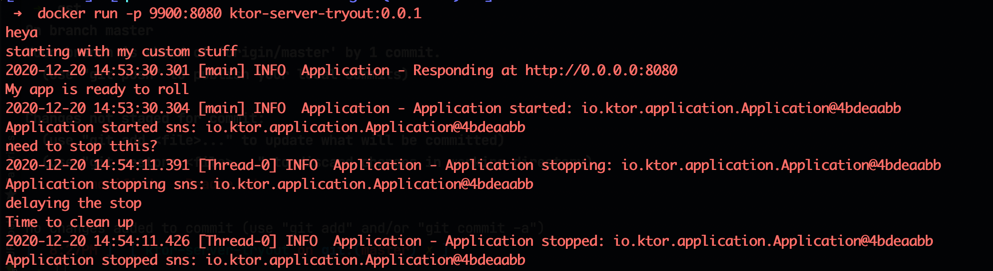

### to build a docker image locally
```shell
./gradlew jibDockerBuild
```

Also one thing to note is if we gracefully stop the running container, 
all the ApplicationStopped events executed gracefully as we anticipated.
I stopped the docker normally using the docker stop cmd

